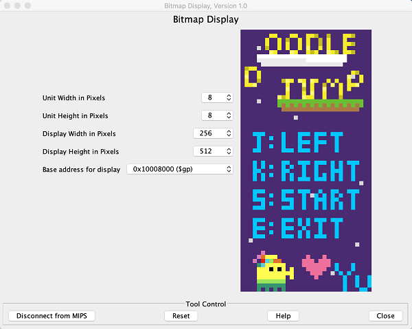
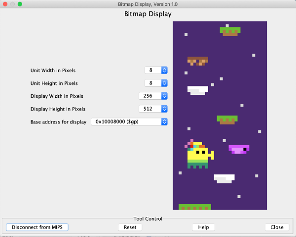

# CSC258-Doodle-Jump
CSC258 Final Project: Doodle Jump

## Author:
Yuuuuuu-xue

## Language:
MIPS Assembly

## Installation and Setup
1. Download the MARS v4.5 from [here](http://courses.missouristate.edu/kenvollmar/mars/download.htm)
2. Open the file *doodlejump.s* in MARS
3. Set up display:
    - Tools > Bitmap display
    - Set:
        - Unit Width in Pixels to **8**
        - Unit Height in Pixels to **8**
        - Display Width in Pixels to **256**
        - Display Height in Pixels to **512**
        - Base address for display to **0x10008000 ($gp)**
    - Click on **Connect to MIPS**
4. Set up keyboard:
    - Tools > Keyboard and Display MMIO Simulator
    - Click on **Connect to MIPS**
5. Run > Assemble
6. Run > Go
7. Input:
    - **r** to start or restart
    - **j** to move left
    - **k** to move right
    - **e** to end the program
    
## Screenshots

